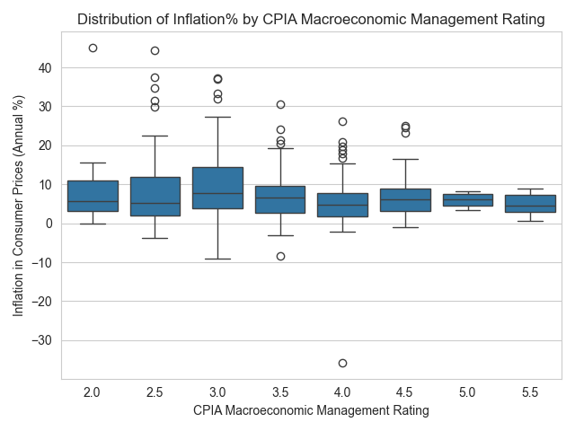

# The Nexus of Macroeconomic Policy Quality on Inflation

## Description

This repository contains all of the working documents and data sources for my Empirical Economics final paper, which investigated the interplay between macroeconomic policy and inflation outcomes using fixed effects interaction term regression. Data is sourced from the World Bank CPIA Dataset, using data from 2006-2015, which has the following distribution with respect to inflation.

## Findings

This study finds that the quality of a nation's **macroeconomic policy exerts a statistically significant influence on inflation outcomes**, but that export activity levels condition this relationship. Specifically, a one-point increase in the CPIA Macroeconomic Management Rating is associated with a 4.644 percentage point decrease in inflation when the export index is 0. However, this inflation-reducing effect weakens by 0.00407 percentage points for each additional point in the export index.

Importantly, macroeconomic policy quality only emerges as a significant predictor of inflation once broader structural factors—including domestic financial sector stability, dedication to debt management, social inclusion, and property rights protections—are controlled for. Policymakers seeking to reduce inflation cannot rely solely on macroeconomic fine-tuning; rather, effective policy must be complemented by robust financial sectors, equitable social policies, and strong institutional frameworks.

>As well, this model finds that macroeconomic policy quality, even after accounting for broader institutional differences and export volumes, only accounts for less than 5 percent in the total variation in a country's inflation rate, showing that inflation is influenced by a multitude of unpredictable factors beyond the scope of macroeconomic policy alone.

Read the full results and findings in `The Nexus of Macroeconomic Policy Quality on Inflation.pdf`
